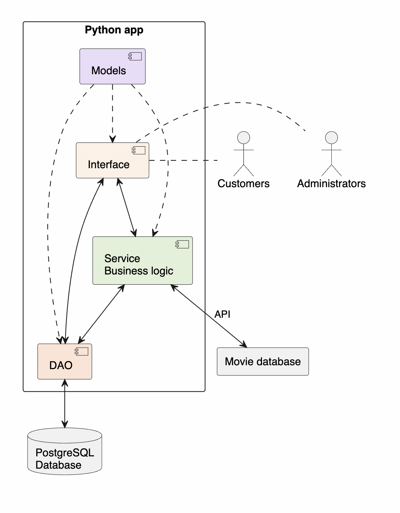

\begin{titlepage}
\centering
\includegraphics{Ensai-logo.png}\\
\vspace{1cm}
{\LARGE\textsc{Ensai Cinema Club}}\\

\vspace{2cm}

\rule{\textwidth}{0.5mm}\\
\vspace {0.3cm}
{\huge\bfseries Analysis File}\\
\vspace {0.5cm}

\rule{\textwidth}{0.5mm}\\

\vspace{3cm}

\begin{flushleft}
\emph{Étudiants:}\\
N. Bougis,\\
S. Mironescu \\
Z. Goulamaly \\
S. Harris
\end{flushleft}

\begin{flushright}
\emph{Tuteur:}\\
C. Valot\\
\end{flushright}

\vfill 
\begin{center}
École Nationale de la Statistique et de l’Analyse de l’Information\\
2025--2026
\end{center}
\end{titlepage}

\newpage

\renewcommand{\contentsname}{Summary}
\tableofcontents

\newpage

# Introduction

# Part 1 – Functional Analysis

## Rephrasing the requirements

## Selected features

### Priority features

### Features included if time allows

### Features excluded

## Summary: Use case diagram
<!--
{#fig-usecase}
-->

# Part 2 – Technical-Functional Layout

## Benchmark of the Movie Information API

## Overall structure and integration with third-party services

## Justification of technical choices

# Part 3 – Technical Design

## Architecture diagram

<!--
{#fig-architecture}
-->

## Data model

<!--
{#fig-dm}
-->

## Class diagram

<!--
{#fig-class}
-->

## Activity diagrams

User activity diagram: booking a screening

Admin activity diagram: scheduling a screening

# Part 4 – Project management description

## Team organization

We are 4 people in the team and each one has a role for the whole project:

| Role | Person |
|---|---|
| Project Manager | Nolann |
| Technical Director | Simon |
| DAO Supervisor | Samuel |
| Testing Supervisor | Zoeb |

## Task assignment

We split the work mostly along these roles. Nolann handles coordination,
planning and keeping the Gantt diagram up to date. Simon takes care of the
technical side, meaning the architecture, the class diagram and the general
design choices. Samuel is more on the data side, so the database and the
data model, and how we access the data. And Zoeb is in charge of testing,
basically making sure stuff actually works before we call it done.

Of course this is not a strict separation: everyone can work on any part if
needed, especially since we're only 4 people. But these roles give each of
us a main area to focus on and to be responsible for.

## Methodology

We have a team meeting every week to check where everyone is, discuss
blocking points and decide what to do next. For now we mostly talk on
WhatsApp when we need to decide something quickly, and we put our documents
on Google Drive so everyone can access them. We know our advisor is not a
big fan of WhatsApp, so we're currently looking for a possibly more
efficient tool, but we haven't switched yet.

The code is on GitHub (github.com/nolannb35/ENSAI-2A-projet-info-team6), we
use it to keep track of the different parts of the project and work at the
same time without breaking each other's code.

We also want to do some kind of review before the big deadlines (Analysis
File, immersion, final delivery), just to check everyone's part actually
fits together before it's too late to fix.

## Gantt diagrams

We made two Gantt charts instead of one: the first for the analysis phase,
up to the Analysis File deadline, and the second for everything after that,
until the final delivery.

### Phase 1: Analysis (28/08 - 17/09)

This phase goes from the start of the project to the Analysis File
deadline. We start by understanding the subject and turning it into real
features, then we do the movie API benchmark at the same time as a first
draft of the technical design, and we finish by writing and reviewing the
report. The three TD meetings are basically checkpoints with our advisor,
where we can still adjust the plan if something's off.

### Phase 2: Development (17/09 - 21/11)

This phase is where we actually code stuff. We start with the backend
(database, movie API, booking, payment, accounting), then the admin
back-office, and we finish with testing, updating the UML diagrams to
match what we actually coded, writing the final report and prepping the
defense. The 3-day immersion in early November is when we're expecting to
move a lot faster than usual since we'll have way more time on it. That's
basically it, everything ends up pointing to the final submission on
21/11.

## Challenges encountered and adjustments

# Conclusion

