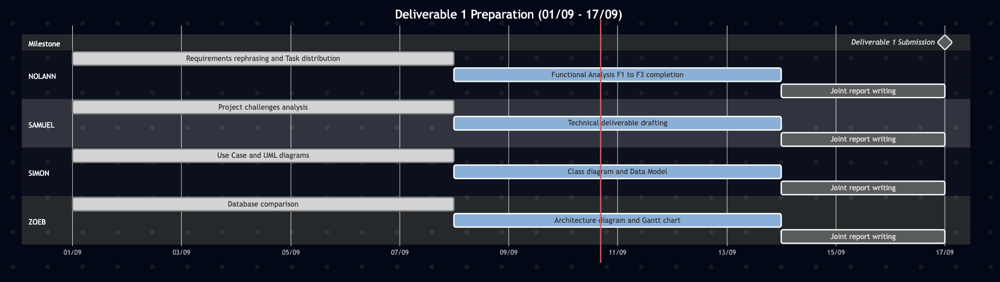

\begin{titlepage}
\centering
\includegraphics{Ensai-logo.png}\\
\vspace{1cm}
{\LARGE\textsc{Ensai Cinema Club}}\\

\vspace{2cm}

\rule{\textwidth}{0.5mm}\\
\vspace {0.3cm}
{\huge\bfseries Analysis File}\\
\vspace {0.5cm}

\rule{\textwidth}{0.5mm}\\

\vspace{3cm}

\begin{flushleft}
\emph{Étudiants:}\\
N. Bougis,\\
S. Mironescu \\
Z. Goulamaly \\
S. Harris
\end{flushleft}

\begin{flushright}
\emph{Tuteur:}\\
C. Valot\\
\end{flushright}

\vfill 
\begin{center}
École Nationale de la Statistique et de l’Analyse de l’Information\\
2025--2026
\end{center}
\end{titlepage}

\newpage

\renewcommand{\contentsname}{Summary}
\tableofcontents

\newpage

# Introduction

*\[Project context, initial problem statement, overall objectives, brief presentation of the intended final product, announcement of the outline.\]*

------------------------------------------------------------------------

# Part 1 – Functional Analysis

## Rephrasing the requirements

## Selected features

### Priority features

### Features included if time allows

### Features excluded

## Summary: Use case diagram

{#fig-usecase}

# Part 2 – Technical-Functional Layout

## Benchmark of the Movie Information API

## Overall structure and integration with third-party services

## Justification of technical choices

# Part 3 – Technical Design

## Architecture diagram

*\[Detailed technical view: application layers, frameworks, hosting, communication between components.\]*

{#fig-architecture}

[*Comment on the diagram ( @fig-architecture): role of each layer, technologies used.*]

## Data model

*\[What information does the application need to store? List the main entities and their attributes.\]*

: Data model — main entities

{#fig-dm}

## Class diagram

*\[Object-oriented structure of the application: classes, attributes, methods, relationships (inheritance, composition, association).\]*

<!--
{#fig-class}
-->

[*Briefly comment on the main classes and their relationships ( @fig-class).*]

## Activity diagrams

{#fig-usecase}

{#fig-usecase}

# Part 4 – Project Management Description

## Organization of the team as a product and development team

*\[Presentation of the team: who plays which role on the "product" side (vision, prioritization) and on the "development" side (implementation).\]*

| Member     | Product role              | Development role    |
|------------|---------------------------|---------------------|
| *\[Name\]* | *\[e.g., Product Owner\]* | *\[e.g., Backend\]* |
| *\[Name\]* |                           |                     |

: Team organization

## Role assignment within the group

*\[Detail of each member's responsibilities, optionally as a RACI table.\]*

| Task / Module | Responsible | Contributors | Approved by |
|---------------|-------------|--------------|-------------|
|               |             |              |             |

: Role assignment (RACI)

## Methodology

*\[Working methodology adopted: Agile/Scrum, sprints, communication tools (Slack, Discord...), task management tools (Trello, Notion, GitHub Projects...), meeting frequency, code management (Git workflow, code reviews).\]*

## Projected schedule – Gantt chart

*\[Schedule of the project's main milestones up to the November deadline.\]*

{#fig-gantt}

## Challenges encountered and adjustments

*\[Optional: lessons learned on project management, unforeseen events, schedule or scope adjustments.\]*

------------------------------------------------------------------------

# Conclusion

*\[Assessment of the work carried out against the objectives set in the introduction, review of features actually delivered vs. planned, limitations of the project, possible future developments.\]*

------------------------------------------------------------------------

# Appendices {.appendix}

- *\[Original requirements / brief\]*
- *\[Significant code excerpts\]*
- *\[Mockups / wireframes\]*
